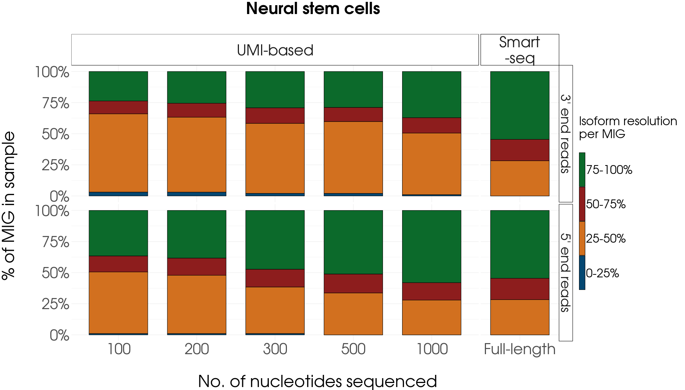
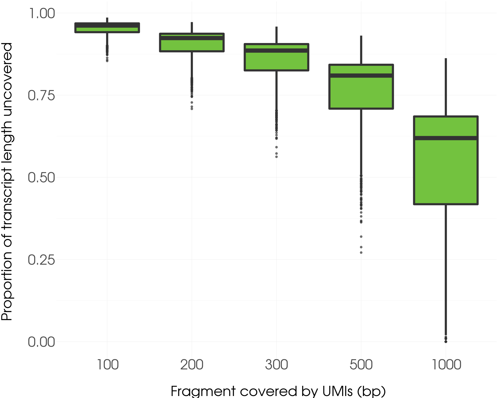

# Short read simulations

This vignette contains the necessary code to reproduce the short read simulations in our manuscript "Single-cell RNAseq for the
study of isoforms -how is that possible?", which can be found [here](https://doi.org/10.1186/s13059-018-1496-z).

### Prepare environment

Load the required libraries:

```
library(readr)
library(stringr)
library(purrr)
library(polyester)
library(dplyr)
library(hash)
library(ggplot2) 
library(scales)
library(ggradar)
```

Load the custom functions in the `sr_simulation_functions.R` file:

`source("sr_simulation_functions.R")`

Load the `transcriptome` object containing the transcript sequences in the Tardaguila et al. (2018) high-quality PacBio transcriptome, and their fasta headers. This is a character vector containing fasta header in the odd, and nucleotide sequences in the even positions.

`load("data/sr_transcriptome.rda")`

Such an object can be obtained by undoing the fasta format using the `undo_fasta()` function in the `sr_simulation_functions.R` file:

`undo_fasta(file_path = "data/transcriptome.fasta", output_path = "data/unformatted_transcriptome.txt")`

### Simulate 3' bias for UMI sequencing methods

We reproduced the 3' (or 5') bias generated by UMI sequencing methods in single-cell RNAseq. We first generated fragments of several lengths (in our manuscript, 100, 200, 300, 500 and 1000 base pairs) from the transcript sequences in `transcriptome` using the custom function `subset_tr()`:

```
for(i in c(100, 200, 300, 500, 1000)){
  subset_tr(tr_set = transcriptome, fragment_length = i, 
            filename = paste0("fragmented.", as.character(i), "nt.pacbio",
                   selected_end = "3end"))
}
```

As a result, a conveniently named fasta file is created for each selected fragment length containing the fragmented transcript sequences and the fasta headers of their transcript of origin. These fragmented transcripts are then used as template  to simulate short reads using the `simulate_experiment()` function from the [polyester](https://github.com/alyssafrazee/polyester) R package.

In order to run all simulations, we have created a data.frame object containing the parameters for `simulate_experiment()` for each of our simulations:

```
load("data/sr_sim.parameters.rda")

sim_parameters
```
```
    length read_length paired
[1]    100          25  FALSE
[2]    200          25  FALSE
[3]    300          50  FALSE
[4]    500          50  FALSE
[5]   1000         100  FALSE

```

For our study, we increased the read length for longer fragments in order to ensure even coverage of the sequences. For UMI simulations, we chose to generate single-end reads.

In addition to `read_length` and `paired`, `simulate_experiment()` can accomodate several conditions and replicates, and requires a `fold_changes` vector specifying the expression change for each transcript between each condition and the first. We will only need one condition and one replicate, as we will only simulate one sample/cell, therefore we create the `fold_changes` vector as follows and will set `num_reps` to 1:

```
fold_changes <- rep(1, length(transcriptome)/2)
num_reps <- 1
```

Finally, `simulate_experiment()` requires a `reads_per_transcript` value. We will obtain these from Tardaguila et al. (2018),  
where Illumina data was used for transcript quantification of two bulk RNAseq samples, Neural Stem Cells and oligodendrocytes, 
and is included in the `data` folder:

```
# neural stem cell and oligodendrocyte expression values for two replicates (data.frame)
load("data/transcript_expression.rda") 
# select one replicate and convert expr values to whole numbers (required by simulate_experiment)
NSC <- round(quantification$POST_NSC1) 
OLD <- round(quantification$POST_OLD1)
```

Now we are ready to run `simulate_experiment()` for each UMI simulation using 100, 200, 300, 500 and 1000 bp fragments contained in each of the previously generated fasta files. As a result, one directory per simulation is generated, each of them containing a fasta file with the simulated reads. Here we present the code for the NSC simulations as an example:

```
for(i in seq(nrow(sim_parameters))){

  # print progress
  message(paste("Simulating reads for", as.character(sim_parameters$length[i]), "nt fragments..."))
  
simulate_experiment(fasta = paste0("fragmented.", as.character(sim_parameters$length[i]), "nt.pacbio.fa"), 
                      outdir = paste0("NSC_", as.character(sim_parameters$length[i]), "nt"), 
                      num_reps = num_reps, 
                      reads_per_transcript = NSC, 
                      readlen = sim_parameters$read_length[i],
                      fold_changes = fold_changes, 
                      paired = sim_parameters$paired[i])
}
```

### Simulate reads from Smart-based methods

In order to simulate reads spanning entire transcripts (as in full-length single-cell RNAseq methods), we run  `simulate_experiment()` on the original Tardaguila et al. (2018) transcript sequences (that is, not fragmented). In this case,  we simulated 250 bp paired-end reads to ensure sufficient coverage:

```
simulate_experiment(fasta = "transcriptome/transcriptome.fasta", 
                    outdir = "NSC_full_length", 
                    num_reps = num_reps, 
                    reads_per_transcript = NSC, 
                    readlen = 250,
                    fold_changes = fold_changes, 
                    paired = TRUE)
```

The resulting fasta file can be found in the `NSC_full_length` folder.

### Process the simulated reads using RSEM+STAR

Although the processed RSEM results are provided in the `data` folder, here we specify the commands needed to replicate the  short read mapping and quantification we performed:

```
# prepare the reference genome (must have the chromosome sequences of the mouse genome as fasta files, replace with your own path)
rsem-prepare-reference data/mouseM10/chromosomes rsem_ref/mouseM10 --gtf transcriptome/annotation.gtf

# example: map and quantify simulated full-length paired-end reads (example)
rsem-calculate-expression --paired-end NSC_full_length/sample_01_1.fasta simulation/NSC_full/sample_01_2.fasta rsem_ref/mouseM10 rsem_results/NSC_full --no-qualities

# example: quantification of single-end short reads generated from 100 nt fragments on the 3' end
rsem-calculate-expression NSC_100nt/sample_01.fasta rsem_ref/mouseM10 rsem_results/NSC_100nt --no-qualities


# move to rsem_results folder to begin the analysis detailed in the next part of the vignette
cd rsem_results
```

Then, load the results into R using the custom processing function, which creates a hash (object from the `hash` package)
containing the gene ID and the number of transcript isoforms which were detected (i.e. expressed > 0 TPM).
```
# load Smart-based simulated data (i.e. quantification results from full-length simulation)
NSC_h <- process_sim_results("NSC_full.isoforms.results")

# load UMI-based simulated data (i.e. quantification of reads from fragmented transcripts)
# filenames output by RSEM are written as SAMPLE_NUMBERnt.isoforms.results
ids.n <- paste0("NSC_", c(100, 200, 300, 500, 1000), "nt")

# each position in the list stores a hash with the results of a simulation
sim.results.NSC <- list()
for (i in seq(length(ids.n))){
  sim.results.NSC[[i]] <- process_sim_results(paste0(ids.n[i], ".isoforms.results"))  
}
```

To generate the comparisons in the manuscript, we take two references. The first reference is the number of isoforms per gene described in the Tardaguila et al. (2018) annotation (i.e. the "true" number of transcript isoforms each gene has in the neural samples sequenced in this study). This will be used to assess the isoform detection potential of the Smart-based methods, i.e.  by comparing the detected to the "true" number of isoforms per multi-isoform gene.


```
# load the entire set of gene-to-isoform relationships annotated in the transcriptome
load("data/gene.isoform_table.rda")

# count no. of isoforms per gene in the annotation
annot_count <- rle(gene.isoform_table$associatedGene)

# make hash of isoforms per multi-isoform gene contained in annotation
mig.annot <- make_mig_ref(hash(annot_count$values, annot_count$lengths)) 
```

And secondly, the number of isoforms per gene detected (TPM > 0) by RSEM+STAR using the Smart-based simulated reads. This will be used to assess the detection potential of different UMI-based simulated libraries, i.e. by comparing the number of isoforms that RSEM can resolve using this data to the number of isoforms detected using Smart-based methods.

```
# preserve NSC_h object, and create new reference hash using process_sim_results()
# then, modify this hash using the make_mig_ref function
mig.NSC <- process_sim_results("NSC_full.isoforms.results") %>% make_mig_ref 
```

Both reference hashes are created using the `make_mig_ref()` custom function.

Alternatively, users may want to skip the RSEM+STAR step. In this case, the already-processed data can be loaded:

```
# load sim.results.NSC: list of UMI simulation results (as hash)
load("data/sr_sim.isoform.results.NSC.rda") 

# load NSC_h: smart-based simulation results (as hash)
load("data/sr_full-length.isoform.results.NSC.rda") 

# load mig.NSC: full-length reference hash
load("data/sr_full-length.reference.hash.rda") 

# load mig.annot: annotation reference hash
load("data/sr_annot.reference.hash.rda") 
```

### Analyse the number of isoforms detected per multi-isoform gene

Using the following code and the `calc_MIG_percent`, we perform the two comparisons described above: Smart-based vs annotation and UMI-based vs Smart-based. The results are output as a percentage (method vs reference), and then binned in four intervals.

```
# Smart-based vs annotation
  resolution_pcnt.NSC <- lapply(sim.results.NSC, calc_MIG_percent, mig.NSC) # resolution percentage for each MIG
  
  # binning of genes according to percentage of resolution intervals
  tmp25n <- lapply(lapply(resolution_pcnt.NSC, as.data.frame), sub_percent, 0, 25) %>% unlist()
  tmp50n <- lapply(lapply(resolution_pcnt.NSC, as.data.frame), sub_percent, 25, 50) %>% unlist()
  tmp75n <- lapply(lapply(resolution_pcnt.NSC, as.data.frame), sub_percent, 50, 75) %>% unlist()
  tmp100n <- lapply(lapply(resolution_pcnt.NSC, as.data.frame), sub_percent, 75, 100) %>% unlist()

# UMI-based vs Smart-based
  resolution_pcnt.NSCannot <- calc_MIG_percent(NSC_h, mig.annot) %>% as.data.frame()
  
  # binning of genes according to percentage of resolution intervals
  tmp25a <- sub_percent(resolution_pcnt.NSCannot, 0, 25)
  tmp50a <- sub_percent(resolution_pcnt.NSCannot, 25, 50)
  tmp75a <- sub_percent(resolution_pcnt.NSCannot, 50, 75)
  tmp100a <- sub_percent(resolution_pcnt.NSCannot, 75, 100)

```

Results are summarized as factors in a data.frame and plotted to compare UMI-based and Smart-based methods. The code is shown for NSC only:

```
pcnt_intervals.NSC <- data.frame(rep(c(100, 200, 300, 500, 1000, 7000), 4), 
                                 c(c(tmp25n, tmp25a), c(tmp50n, tmp50a), c(tmp75n, tmp75a), c(tmp100n, tmp100a)), 
                                 c(rep(4,6), rep(3,6), rep(2,6), rep(1,6)),
                                 c(rep(1, 5), 2))
colnames(pcnt_intervals.NSC) <- c("nucleotides", "percentage", "interval", "library")
pcnt_intervals.NSC$interval <- factor(pcnt_intervals.NSC$interval, 
                                      labels = rev(c("0-25%", "25-50%", "50-75%", "75-100%")))
pcnt_intervals.NSC$library <- factor(pcnt_intervals.NSC$library, labels = c("UMI-based", "Smart\n-seq"))
pcnt_intervals.NSC$percentage <- as.integer(pcnt_intervals.NSC$percentage)
pcnt_intervals.NSC$nucleotides <- factor(pcnt_intervals.NSC$nucleotides, 
                                         labels = c("100", "200", "300", "500", "1000", "Full-length"))
                                         
# plot percentage of resolution intervals for UMI vs full-length simulations and full-length simulation vs annotation
ggplot() + ggtitle("Neural stem cells") + 
  geom_bar(data = pcnt_intervals.NSC, aes(fill = interval, x = nucleotides, y = percentage), width = 0.75,
           position = "fill", stat = "identity", colour = "black") +
  labs(x = "Nucleotides sequenced from 3' end", y = "% of MIG in sample") +
  scale_y_continuous(labels = percent_format()) + 
  theme(text = element_text(family = "AvantGarde"),
        axis.text = element_text(size = 14), axis.title = element_text(size = 20), 
        legend.text = element_text(size = 14), legend.title = element_text(size = 16),
        plot.title = element_text(size = 20, hjust = 0.5, face = "bold"),
        strip.text.x = element_text(size= 14),
        strip.background = element_rect(colour = "black")) +
  scale_fill_manual(name = "Isoform resolution per MIG", values = c("#0C6A2B", "#8D1D1D", "#D2701F", "#044771")) +
  facet_grid(. ~ library, scales = "free", space = "free")
```

The comparative plot of the simulations from the 3' and 5' ends (Figure 5.b in our manuscript) can be produced by loading the data frame where results for the 5' end are also included, which is provided in the `data` folder. These results can be generated by running the simulation method again on fragments generated from the 5' end of transcripts and combining both data frames.

```
# load data
load("data/sr_pcnt.interval.results.both.ends.rda")

# plot
ggplot() + ggtitle("Neural stem cells \n") + 
  geom_bar(data = pcnt_intervals.NSC.3and5end, aes(fill = interval, x = nucleotides, y = percentage), width = 0.75, 
           position = "fill", stat = "identity", colour = "black") +
  labs(x = "\n No. of nucleotides sequenced", y = "% of MIG in sample \n") +
  scale_y_continuous(labels = percent_format()) +
  theme_minimal() +
  theme(text = element_text(family = "AvantGarde"), axis.text = element_text(size = 40), 
        axis.title.x = element_text(size = 44), axis.title.y = element_text(size = 44),
        legend.text = element_text(size = 32), legend.title = element_text(size = 32),
        #legend.position = "bottom",
        plot.title = element_text(size = 44, hjust = 0.5, face = "bold"),
        strip.text.x = element_text(size= 40), strip.text.y = element_text(size= 36),
        strip.background = element_rect(colour = "black")) +
  scale_fill_manual(name = "Isoform resolution \nper MIG \n", values = c("#0C6A2B", "#8D1D1D", "#D2701F", "#044771")) +
  facet_grid(end ~ library, scales = "free", space = "free")
```




### Analyse simulated length bias

To ensure that the simulated UMI reads successfully recreate a coverage bias, we perform an analysis of the percentage of the trancripts that is left uncovered in each of our simulations (see Figure 5.a in our manuscript).

```
# get lengths of transcript sequences
headers_lgl <- str_detect(transcriptome, ">")
seqs <- transcriptome[!headers_lgl]
lengths <- str_length(seqs)

# fragment lengths
trim_lengths <- c(100, 200, 300, 500, 1000)

# calculate percentage uncovered when transcript is fragmented
fragment_lengths <- map(lengths, ~((. - trim_lengths) / .)) 

# format data as factors for plotting
plot_trimming <- data.frame(missing_pcnt = unlist(fragment_lengths), 
                            trim_length = ordered(rep(trim_lengths, length(fragment_lengths))))

# replace values below zero with zero (when transcript length < trimmed fragment, the transcript is left intact, and therefore is fully covered)
lgl <- plot_trimming$missing_pcnt < 0
plot_trimming$missing_pcnt[lgl] <- 0

# boxplot of distribution of proportion uncovered for different  UMI simulations
ggplot(plot_trimming, aes(y = missing_pcnt, x = trim_length)) + 
  geom_boxplot(outlier.alpha = 0.7, size = 4, outlier.size = 4, fill = "#73C23F") + 
  labs(x = "\n Fragment covered by UMIs (bp)", y = "Proportion of transcript length uncovered \n") +
  theme_minimal() +
  theme(text = element_text(family = "AvantGarde"), axis.text = element_text(size = 56), 
        axis.title.x = element_text(size = 56), axis.title.y = element_text(size = 56)) + 
  guides(fill = FALSE)

```



